<div align="center">

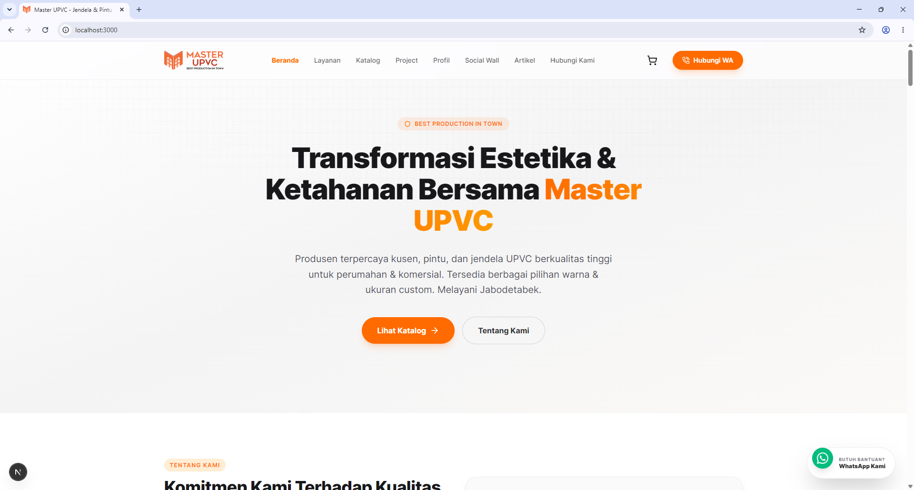

<br/><br/>

# 🏠 Master UPVC Indonesia

### Website Bisnis UPVC Full-Stack dengan CMS Admin Terintegrasi

<p>
  <a href="https://nextjs.org/"></a>
  <a href="https://www.typescriptlang.org/"></a>
  <a href="https://tailwindcss.com/"></a>
  <a href="https://www.mysql.com/"></a>
  <a href="https://nodejs.org/"></a>
  
</p>

<p>
  
  
  
  
  
</p>

<br/>

> **Website company profile dan e-catalog profesional untuk bisnis UPVC**  
> Dibangun di atas Next.js 15 App Router + TypeScript dengan CMS Admin panel yang lengkap,  
> tanpa biaya langganan CMS pihak ketiga.

**[📦 Panduan Instalasi](#-instalasi)** &nbsp;·&nbsp; **[🔐 Fitur CMS Admin](#-fitur-cms-admin)** &nbsp;·&nbsp; **[🌐 Environment Variables](#-environment-variables)**

</div>

---

## 📸 Tampilan Website

### 🌐 Halaman Publik (Frontend)

| Beranda | Halaman Project |
|---|---|
|  | 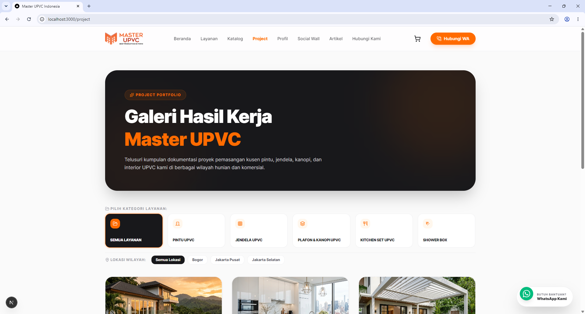 |

| Katalog Produk | Profil Perusahaan |
|---|---|
| 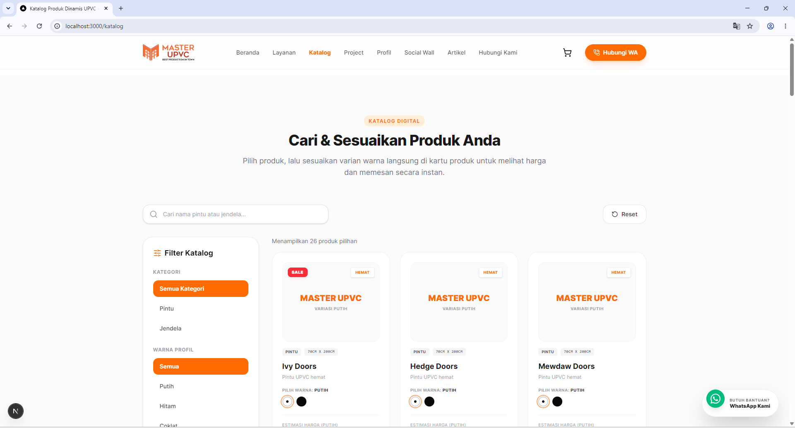 | 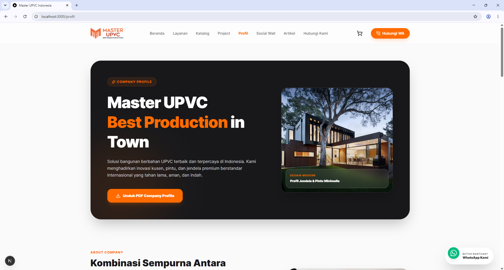 |

| Halaman Kontak |
|---|
| 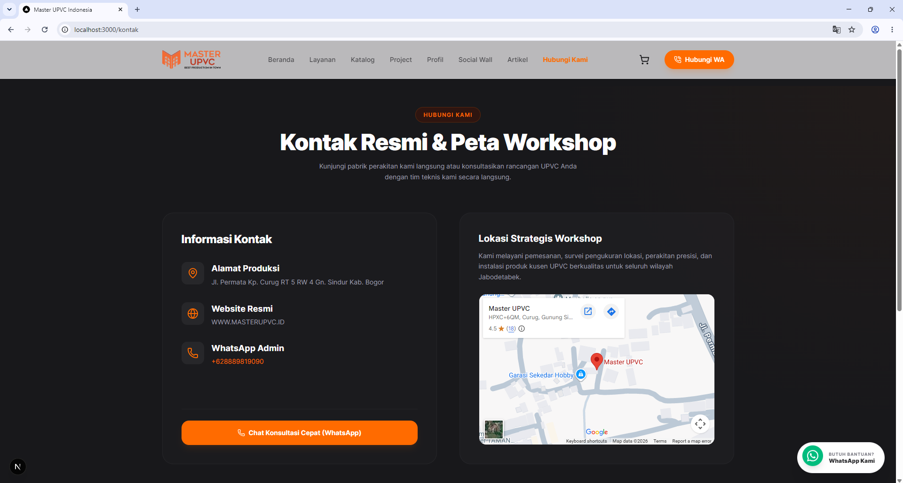 |

### 🔐 Panel CMS Admin

| Kelola Layanan | Kelola Project |
|---|---|
| 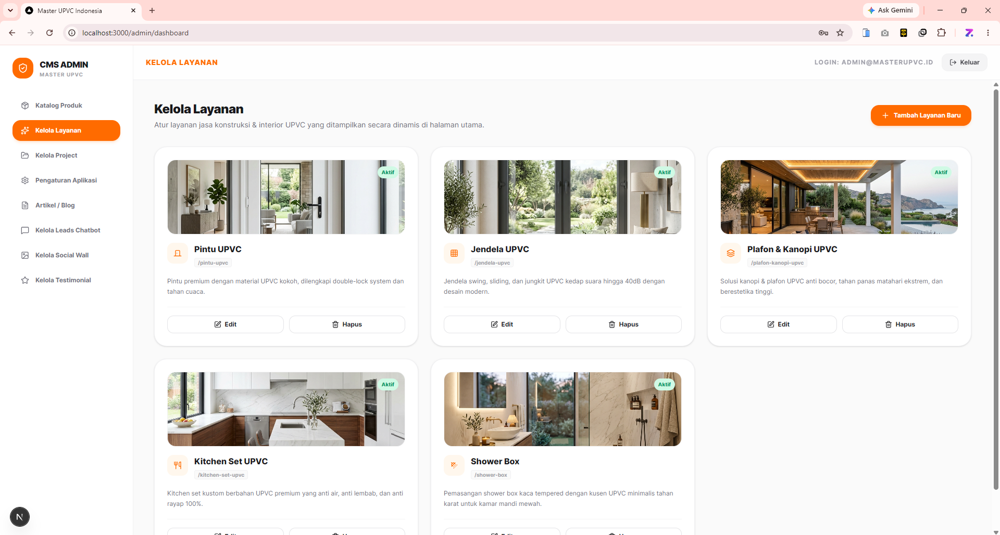 | 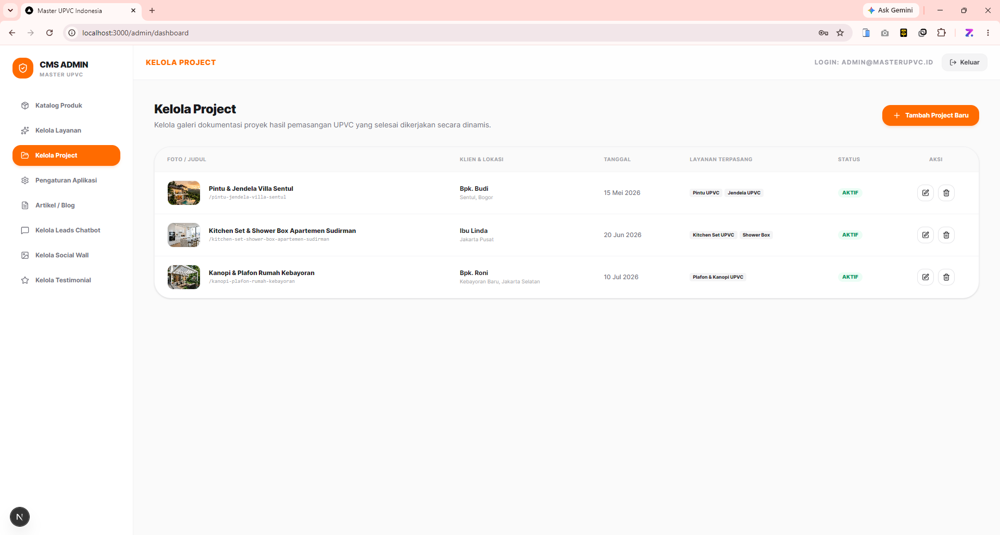 |

| Kelola Katalog Produk | Pengaturan Aplikasi |
|---|---|
| 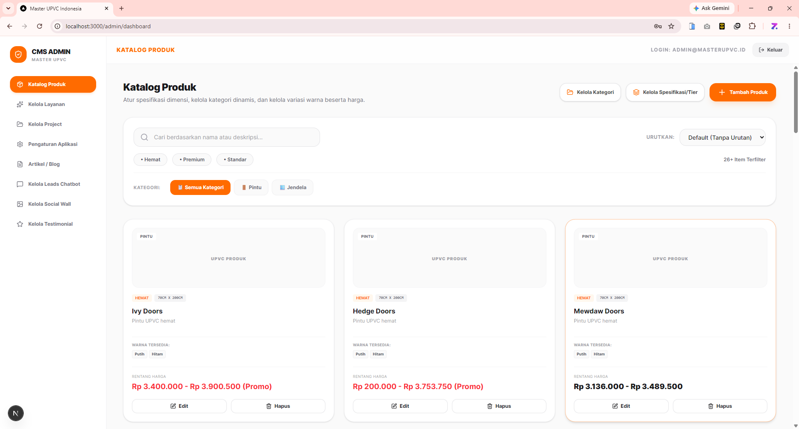 | 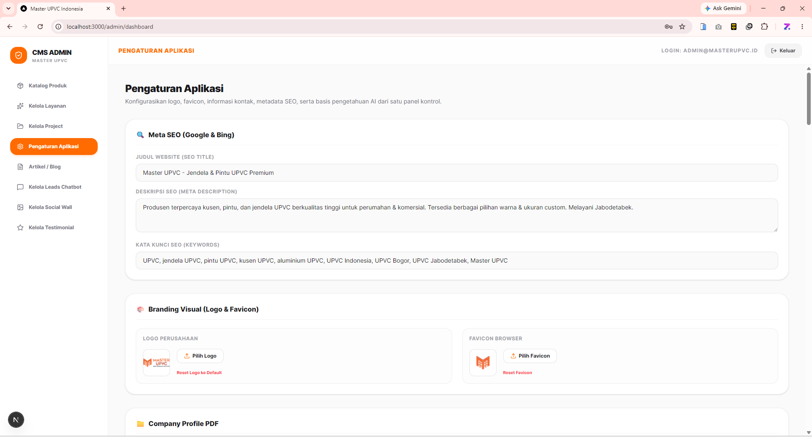 |

| Kelola Artikel / Blog | Kelola Social Wall |
|---|---|
| 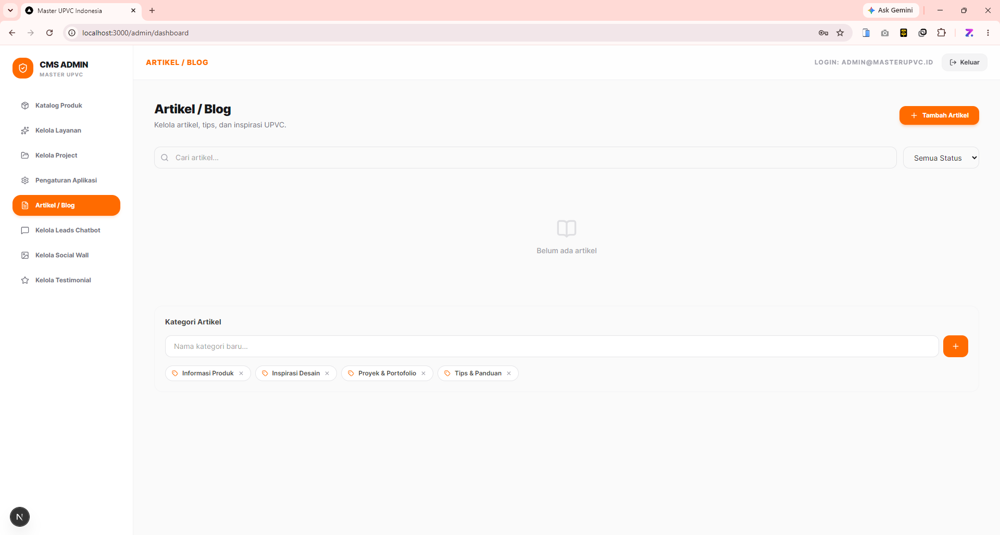 | 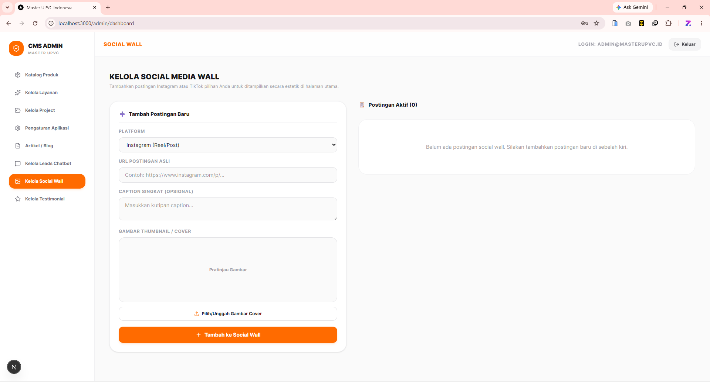 |

| Kelola Leads Chatbot | Kelola Testimoni |
|---|---|
| 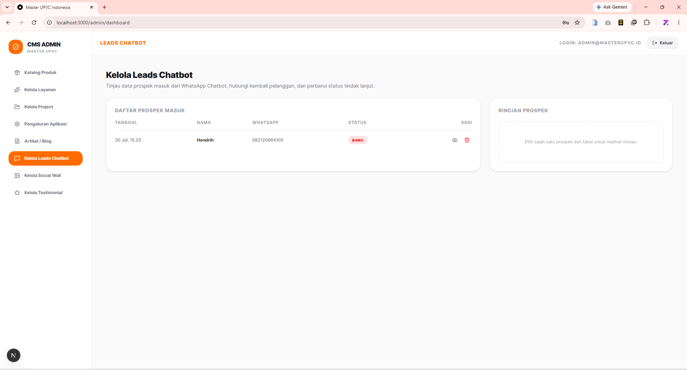 | 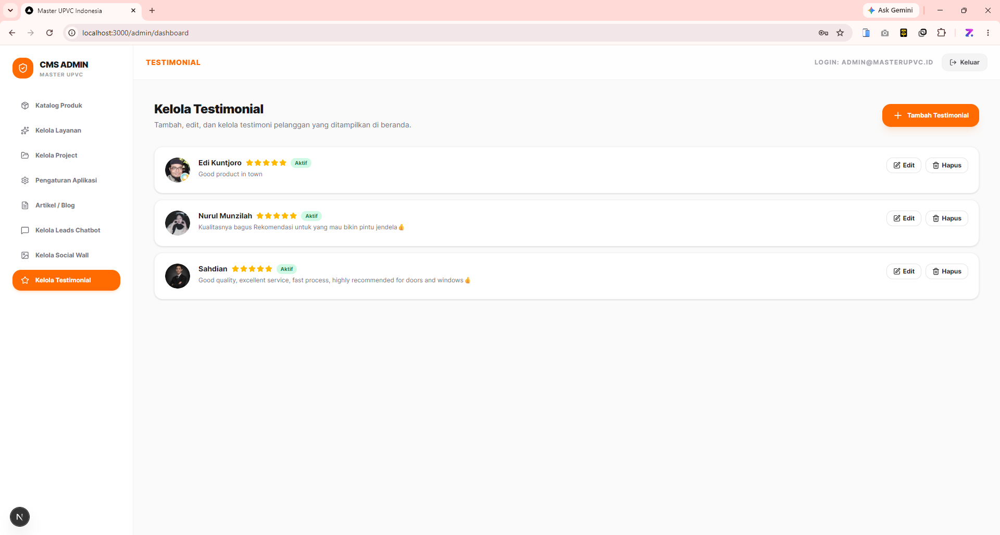 |

---

## ✨ Fitur Lengkap

### 🌐 Frontend Publik
- **Beranda** — Hero section, tentang kami, layanan dinamis, testimonial, social wall & CTA
- **Katalog Produk** — Popup detail varian, multi-gambar per varian, filter kategori
- **Halaman Project** — Filter Grid Card by layanan (dari DB), slider project terkait di detail
- **Halaman Profil** — Tentang perusahaan, visi misi, tim
- **Social Wall** — Feed konten sosial media dinamis
- **Artikel / Blog** — Daftar & halaman detail artikel
- **Kontak** — Form kontak + peta lokasi
- **WhatsApp Floating CTA** — Tombol konsultasi WA otomatis di seluruh halaman
- **Leads Chatbot** — Chatbot tangkap leads dengan basis pengetahuan produk

### 🔐 CMS Admin Panel (`/admin/dashboard`)

| Modul | Fitur |
|---|---|
| **Katalog Produk** | CRUD produk & varian, multi-gambar, status aktif/nonaktif |
| **Kelola Layanan** | CRUD layanan, gambar, ikon Lucide, deskripsi, slug |
| **Kelola Project** | CRUD project, multi-gambar, layanan terpasang, lokasi, klien |
| **Pengaturan Aplikasi** | Logo, favicon, SEO title/description/keywords, nomor WA, Company Profile PDF |
| **Artikel / Blog** | CRUD artikel dengan konten rich text |
| **Social Wall** | Kelola postingan sosial media |
| **Kelola Testimoni** | CRUD testimoni klien |
| **Kelola Leads Chatbot** | Basis pengetahuan AI chatbot |

### 🛠 Stack Teknologi

**Frontend & Framework**


**Backend & Database**


**Deployment**


**Tools & Dev**


---

## 🗄 Struktur Database

Jalankan file [`database.sql`](./database.sql) untuk membuat semua tabel:

```sql
-- Tabel yang akan dibuat:
-- products, product_variants, product_images
-- services
-- projects
-- articles
-- social_wall_posts
-- testimonials
-- website_settings
-- chatbot_knowledge, chatbot_leads
```

---

## 📦 Instalasi

### Prasyarat

Pastikan sistem Anda sudah memiliki:
- **Node.js** versi `18.x` atau lebih baru → [Download](https://nodejs.org)
- **MySQL** versi `8.x`
- **Git** → [Download](https://git-scm.com)

---

### 1️⃣ Instalasi di Lokal (Laragon / XAMPP / MAMP)

**Clone Repository**
```bash
git clone https://github.com/YOURUSERNAME/masterupvc.id.git
cd masterupvc.id
```

**Install Dependencies**
```bash
npm install
```

**Konfigurasi Environment**

Buat file `.env.local` di root project:
```env
DB_HOST=localhost
DB_PORT=3306
DB_USER=root
DB_PASS=
DB_NAME=masterupvc
ADMIN_USERNAME=admin
ADMIN_PASSWORD=rahasia123
```

**Buat Database & Import Schema**

Buka phpMyAdmin atau MySQL CLI:
```sql
CREATE DATABASE masterupvc CHARACTER SET utf8mb4 COLLATE utf8mb4_unicode_ci;
```
```bash
mysql -u root -p masterupvc < database.sql
```

**Jalankan Development Server**
```bash
npm run dev
```

Buka `http://localhost:3000` · Admin: `http://localhost:3000/admin`

---

### 2️⃣ Deploy ke VPS (Ubuntu/Debian) dengan PM2 + Nginx

**Siapkan Server**
```bash
sudo apt update && sudo apt upgrade -y

# Install Node.js 20 LTS
curl -fsSL https://deb.nodesource.com/setup_20.x | sudo -E bash -
sudo apt install -y nodejs

# Install PM2
sudo npm install -g pm2

# Install MySQL
sudo apt install -y mysql-server
sudo mysql_secure_installation
```

**Clone & Setup Project**
```bash
cd /var/www
sudo git clone https://github.com/YOURUSERNAME/masterupvc.id.git
cd masterupvc.id
sudo npm install
sudo nano .env.local   # isi dengan kredensial database
```

**Setup Database**
```bash
sudo mysql -u root -p
```
```sql
CREATE DATABASE masterupvc CHARACTER SET utf8mb4 COLLATE utf8mb4_unicode_ci;
CREATE USER 'upvc_user'@'localhost' IDENTIFIED BY 'StrongPassword123!';
GRANT ALL PRIVILEGES ON masterupvc.* TO 'upvc_user'@'localhost';
FLUSH PRIVILEGES;
```
```bash
mysql -u upvc_user -p masterupvc < database.sql
```

**Build & Jalankan dengan PM2**
```bash
npm run build
pm2 start npm --name "masterupvc" -- start
pm2 startup
pm2 save
```

**Konfigurasi Nginx Reverse Proxy**
```bash
sudo apt install -y nginx
sudo nano /etc/nginx/sites-available/masterupvc.id
```
```nginx
server {
    listen 80;
    server_name masterupvc.id www.masterupvc.id;

    location / {
        proxy_pass http://localhost:3000;
        proxy_http_version 1.1;
        proxy_set_header Upgrade $http_upgrade;
        proxy_set_header Connection 'upgrade';
        proxy_set_header Host $host;
        proxy_cache_bypass $http_upgrade;
        proxy_set_header X-Real-IP $remote_addr;
        proxy_set_header X-Forwarded-For $proxy_add_x_forwarded_for;
    }
}
```
```bash
sudo ln -s /etc/nginx/sites-available/masterupvc.id /etc/nginx/sites-enabled/
sudo nginx -t && sudo systemctl reload nginx
```

**SSL Gratis dengan Let's Encrypt**
```bash
sudo apt install -y certbot python3-certbot-nginx
sudo certbot --nginx -d masterupvc.id -d www.masterupvc.id
```

---

### 3️⃣ Deploy ke Vercel (Paling Mudah)

**Push ke GitHub**
```bash
git add .
git commit -m "Initial commit"
git push origin main
```

**Import di Vercel**
1. Buka [vercel.com](https://vercel.com) → **Add New Project**
2. Import repository GitHub Anda
3. Pada **Environment Variables**, tambahkan semua isi `.env.local`
4. Klik **Deploy** ✅

> ⚠️ Vercel bersifat *serverless* — tidak ada MySQL lokal. Gunakan database cloud:
> - **PlanetScale** (MySQL serverless gratis)
> - **Railway** (MySQL cloud mudah)
> - **Aiven** (MySQL cloud)

---

### 4️⃣ Deploy ke cPanel / Shared Hosting

> ⚠️ Pastikan provider hosting Anda mendukung **Node.js Application** (cPanel v78+). Contoh: Niagahoster Business, Hostinger Premium, DomaiNesia Cloud.

**Aktifkan Node.js di cPanel**
1. Login cPanel → **"Setup Node.js App"**
2. Klik **Create Application**
3. Node.js version: `20.x`
4. Application root: `public_html/masterupvc`
5. Application startup file: `server.js`
6. Klik **Create**

**Upload File**

Via SSH:
```bash
cd public_html/masterupvc
git clone https://github.com/YOURUSERNAME/masterupvc.id.git .
```

Atau via **File Manager cPanel** — upload semua file project.

**Buat `server.js` di Root Project**
```js
const { createServer } = require('http');
const { parse } = require('url');
const next = require('next');

const dev = process.env.NODE_ENV !== 'production';
const app = next({ dev });
const handle = app.getRequestHandler();

app.prepare().then(() => {
  createServer((req, res) => {
    const parsedUrl = parse(req.url, true);
    handle(req, res, parsedUrl);
  }).listen(process.env.PORT || 3000, (err) => {
    if (err) throw err;
    console.log('> Ready on port', process.env.PORT || 3000);
  });
});
```

**Setup Environment & Install di cPanel**
1. Di panel Node.js App → **Edit** → tambahkan semua environment variable
2. Klik **Run NPM Install**
3. Via SSH: `npm run build`
4. Klik **Restart**

**Setup Database MySQL di cPanel**
1. cPanel → **MySQL Databases** → Buat database: `namauser_masterupvc`
2. Buat user & hubungkan ke database
3. **phpMyAdmin** → pilih database → **Import** → upload `database.sql`
4. Update `.env.local` dengan kredensial cPanel

---

### 5️⃣ Deploy ke Railway (Mudah + MySQL Cloud)

Railway mendukung Node.js + MySQL dalam satu platform.

1. Daftar di [railway.app](https://railway.app)
2. **New Project** → **Deploy from GitHub repo**
3. Tambahkan service **MySQL** di project yang sama
4. Salin kredensial MySQL Railway ke **Environment Variables**:
```env
DB_HOST=containers-us-west-XXX.railway.app
DB_PORT=XXXXX
DB_USER=root
DB_PASS=XXXXXXXXX
DB_NAME=railway
```
5. Railway otomatis build & deploy ✅

---

## 🔑 Akses Panel Admin

```
URL   : https://yourdomain.com/admin
User  : [ADMIN_USERNAME dari .env.local]
Pass  : [ADMIN_PASSWORD dari .env.local]
```

> 🔐 **Keamanan**: Ganti password default sebelum deploy ke produksi!

---

## 📁 Struktur Folder Project

```
masterupvc.id/
├── src/
│   ├── app/
│   │   ├── admin/dashboard/     # CMS Admin Panel
│   │   ├── api/                 # API Routes (products, services, projects, dll.)
│   │   ├── artikel/             # Halaman artikel/blog
│   │   ├── katalog/             # Halaman katalog produk
│   │   ├── kontak/              # Halaman kontak
│   │   ├── profil/              # Halaman profil perusahaan
│   │   ├── project/             # Halaman project (listing + [slug] detail)
│   │   ├── social-wall/         # Halaman social wall
│   │   ├── page.tsx             # Halaman beranda
│   │   └── layout.tsx           # Root layout
│   ├── components/
│   │   ├── Navbar.tsx           # Header navigasi
│   │   ├── Footer.tsx           # Footer
│   │   └── Chatbot.tsx          # Komponen chatbot leads
│   └── utils/
│       ├── db.ts                # Database helper & CRUD functions
│       └── seedData.ts          # Static fallback data
├── public/
│   └── images/
│       ├── projects/            # Gambar project
│       └── services/            # Gambar layanan
├── image/
│   ├── admin/                   # Screenshot panel admin
│   └── frontend/                # Screenshot halaman publik
├── database.sql                 # Schema & seed database lengkap
├── .env.local                   # Konfigurasi environment (JANGAN di-commit!)
└── next.config.ts               # Konfigurasi Next.js
```

---

## 🌐 Environment Variables

```env
# ==================== Database MySQL ====================
DB_HOST=localhost
DB_PORT=3306
DB_USER=root
DB_PASS=
DB_NAME=masterupvc

# ==================== Admin CMS ====================
ADMIN_USERNAME=admin
ADMIN_PASSWORD=ganti_dengan_password_kuat
```

---

## 🤝 Kontribusi

Pull request sangat disambut! Untuk perubahan besar, buka issue terlebih dahulu.

---

## 📄 Lisensi

Proyek ini dilisensikan di bawah [MIT License](LICENSE).

---

<div align="center">

**Dibuat dengan ❤️ untuk bisnis UPVC Indonesia**

</div>
